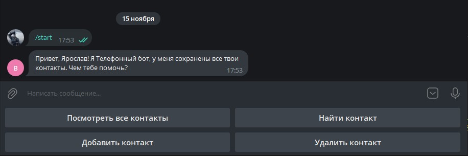
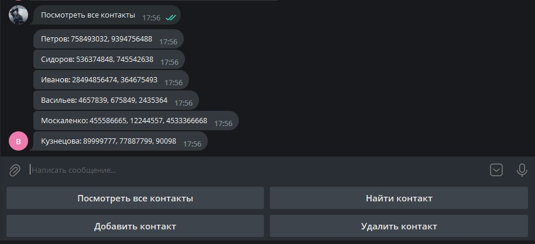
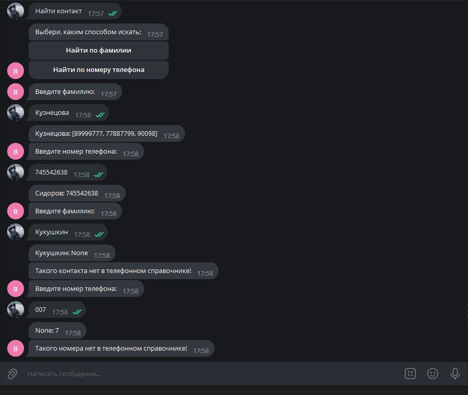
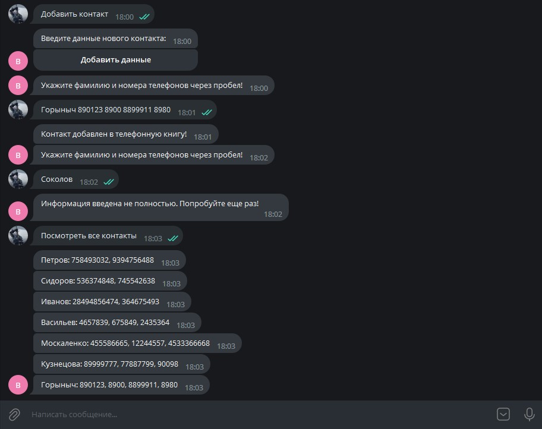
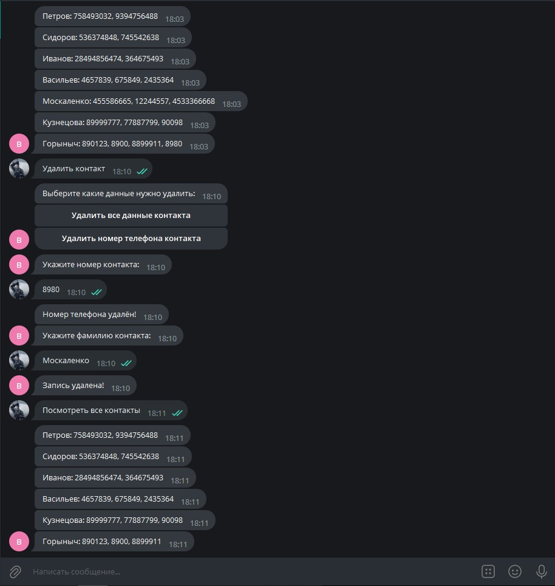

# Задача: Создать Telegram-бота, который будет работать с телефонной книгой пользователя.

База данных с контактами (телефонной книгой) размещена в файле .json.

## Возможности Telegram-бота.
  Приветствие пользователя:

По запросу пользователя Telegram-бот:
1. выдаёт список всех контактов

2. находит данные контакта по введенной фамилии или по введенному номеру телефона находит фамилию контакта

3. добавляет новый контакт с неограниченным количеством номеров в телефонную книгу

1. удаляет все данные контакта или номер телефона контакта

Над проектом работали:
* Дмитрий Корчагин
* Дарья Ермакова
* Ольга Симахина
* Ярослав Соловьев
* Дарья Нестерова