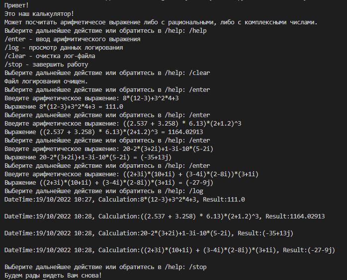

# Калькулятор для работы с рациональными и комплексными числами.
## Порядок работы:
1. Программа запускается из модуля main.py
2. Команды вводятся в формате /{command}
3. Со списком комманд можно ознакомится введя команду /help:
    - /enter - ввод арифмитического выражения;
    - /log - просмотр данных логирования;
    - /clear - очистка лог-файла;
    - /stop - завершить работу.
4. Арифметическое выражение вводится в виде строки
5. Подсчет предыдущих выражений фиксируется в лог-файле
6. Комплексные числам вводятся в формате a+bi

## Пример работы программы:

Work team:
1. Соловьев Ярослав - module_racio.py
2. Нестерова Дарья - logger.py; controller.py
3. Корчагин Дмитрий - module_complex.py; main.py